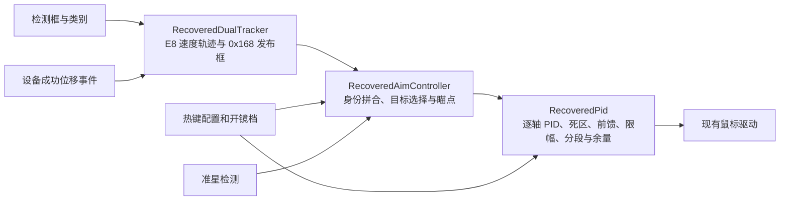

# 2026-10-03 当前覆盖说明

当前 FF 已去掉末端 15Hz 滤波，并新增静止目标一次性 X/Y 换算与响应延迟标定；跟随补偿的饱和保护读取本次 PID 实际限幅状态。正常运行不加入背景处理或新的等待。详见《控制层调参手册.md》顶部操作说明；下面的 2026-10-02 冻结恢复说明保留为历史记录，之后已有 P/I/D 稳定化迭代，并非当前实现的全部行为。

# 2026-10-02 恢复说明（历史）

基础 PID 来源为指定会话的 GenshinImpact.sp.exe 逆向，不是 AM。2026-10-02 按用户要求恢复二次移植刚完成时的基础 PIDF：FF 读取双跟踪拼合速度，速度估计再次叠加成功发送鼠标运动事件的固定 0.91 换算；跟踪器使用采集帧间隔，PID 使用控制更新间隔；换目标时清积分并用新误差初始化微分。Ki 或 FF 上限回到 10，Ki 数值变化时清对应轴积分，KpX 或分段设置变化时跳过一次输出。基础 PIDF 在代码注释中标为后续冻结；另加的跟随补偿与瞄点外推不属于该基础 PIDF。以下较早方案按历史记录阅读。

# 控制器移植状态

源资料：`C:/Users/Administrator/Desktop/GenshinImpact/_amrev`。该目录是逆向笔记与反编译片段，尚无可直接编译的控制器。以下区分已接入的行为和仍待核对的行为。

## 已替换

- 运行循环调用 `RecoveredAimController`；旧 `AimController`、PID、选择器实现、稳定器和 α‑β 滤波器已从构建及运行路径移除。
- 跟踪器按类别、距离和 IoU 匹配，维护目标身份和短暂丢帧状态。二次移植增加 E8/0x168 两套记录：0x168 同帧重叠框合并、独立框状态、按身份和严格小于 1 px 的中心门拼合 E8 速度。空候选帧保留 0x168 状态而推进 E8 miss。速度增加逐轴低速/反向门和按成功发送事件时间窗计算的前馈修正。
- 选择器使用准星到目标框的最短距离与面积归一化，并保留当前目标的粘滞选择。瞄点继续使用项目已有的分类 X/Y 偏移；基础点按逆向笔记 21 的 X 四舍五入、Y 截断顺序计算。
- PID 按逆向笔记 08、24、77、92、105、106 的已核对顺序计算：逐轴 PID、死区衰减、速度前馈、限幅、分段、整数输出余量；普通空帧保留 PID 状态。
- UI 和配置新增独立的默认档与开镜档移植 PID 参数。旧 `ctl_*` 增益继续可读取和保存，以兼容现有配置文件，但不再进入新 PID。原有分类瞄点 X 偏移保留。

## 仍待源资料补全

- 当前只保留一套 `RecoveredPid`。已删除桌面 AVA 与独立延迟闭环试验实现、算法选择器及其配置写回；新增卡尔曼估速与提前帧数，FF 保持原路径。
- 0x168 框状态目前只实现了默认有限值的同帧合并、匹配和位置协方差校正；完整四轴速度协方差、预测状态位、异常浮点与独立时钟仍未复原，不保证所有目标框与速度逐位一致。E8 的历史预筛排序也仍由上游候选顺序决定。
- 源选择器的完整回退分支、目标点离散模式、异步输出和曲线输出尚未移植。项目现有鼠标轨迹模式仍在 PID 之后工作，启用这些模式时最终鼠标输出不等于源程序的直接输出分支。

## 2026-09-25 新证据与二次移植判断

需要二次移植，重点是跟踪与前馈的上游状态，不是重写已经接入的 PID 主公式。

1. **双跟踪及拼合已接入默认有限值路径。** 181、182、183 号材料证实源程序的 E8 轨迹负责速度，独立的 0x168 状态记录负责发布目标框；0x168 先按同类与 IoU 合并当帧框，再按身份及严格小于 1 px 的中心距离拼合 E8 速度。空候选帧两套状态的推进方式也不同（129）。本次实现保留候选输入顺序；构造历史排序可能改变该顺序（182），但历史预筛本身尚未移植。
2. **逐轴前馈与成功运动事件已接入默认有限值路径。** 20、161、163 给出逐轴速度门、反向/低速分段及尺寸阈值。本次用源构造默认值实现这些分支；鼠标驱动仅在成功发送后记录带时间戳的运动事件，控制器按统计窗和来源/模长权重汇总，送入 E8 速度更新。186 的离线样本数值已用于回归。源程序完整的运动状态标志、辅助速度和复杂事件上下文仍未复原。
3. **输出路由需单独设计。** 184、185 将曲线开关、profile 表资格及 worker 状态分成直连、同步曲线和三种异步任务。当前 `RecoveredPid` 固定携带余数并整数化，后面还可能经过项目的 `AimPathDriver`；它只对应源程序的直连和同步短位移条件，不能代表全部路由。先保证默认直连/短位移路径的明确映射，再决定是否引入异步 worker；静态 INI 和离线样本无法证明运行时落入哪条分支。
4. **暂不据离线样本推断实机输出。** 181–186 用保存的 CPU 模型输出、合成的第二帧、冷态与若干运行资格假设复算；它们不是实时捕获。183 与 186 在不同事件假设下的第二帧连续 PID 值不同，虽然该样本整数结果同为 `(6,-1)`。需要用已确认的分支和有代表性的序列检验移植，而不是硬编码样本整数。

## 当前：X/Y 跟随补偿（2026-09-28）

提前帧数方案因实机静止目标抖动而撤回。当前以 X/Y 独立的慢速持续误差补偿替代，参数放在各轴死区半径下，默认 0。原 PID/FF 不改，不再读鼠标输出来构造预测速度。完整实现和编译验证范围以《位置提前量方案评审.md》《控制层调参手册.md》为准；本次按要求不运行测试。

## 历史：已撤回的卡尔曼估速与提前帧数（2026-09-28）

当前只保留一套原 PID；新增预测在 PID 输入之前工作。借鉴最早 AVA 的“位置变化 + 自身输出”，独立累计成功发送量并结合原始检测中心更新卡尔曼跟随状态，用“跟随状态 × 最近图像间隔 × 提前帧数”外推原瞄点。原 FF 不变，不新增灵敏度标定或 0.91 换算。界面为 0–10 帧，默认 0，步长 0.5 帧。该状态是经验运动补偿，不宣称准确目标速度；本次用户要求仅编译，不运行测试，旧相对速度测试报告不代表本版验证结果。

上一版 alpha-beta 毫秒提前量及其对 PID 内部的改动已经撤回：不再修正基础滤波位置、不再单独给 D 提供原始误差、不再增加预测专用的积分防饱和或重置 PID 状态。FF 保留原路径。旧毫秒键忽略，保存时不写回，原 Kp/Ki/Kd/FF 保留。

详细说明见 [位置提前量方案评审](位置提前量方案评审.md)。

## 验证

`tests/recovered_controller_test.cpp` 校验逆向笔记 77 的连续输出、前馈和分段切换，90 的两帧跟踪数值，181/183 的双框合并与速度拼合，186 的成功事件前馈，空帧重获，以及配置到控制器的 X/Y 瞄点映射。`tests/config_migration_test.cpp` 校验新旧配置读取与写回。Release 主程序构建和 CTest 为编译与离线回归；实际设备上的运动表现尚需实测。

`tests/aimpoint_prediction_test.cpp` 验证提前帧数、原 PID 等价性与 FF 独立性、观测时序、急停反向、状态重置及 144 组覆盖纯 P 及非零 I/D 的闭环场景。预览和回放显示实际预测瞄点。
